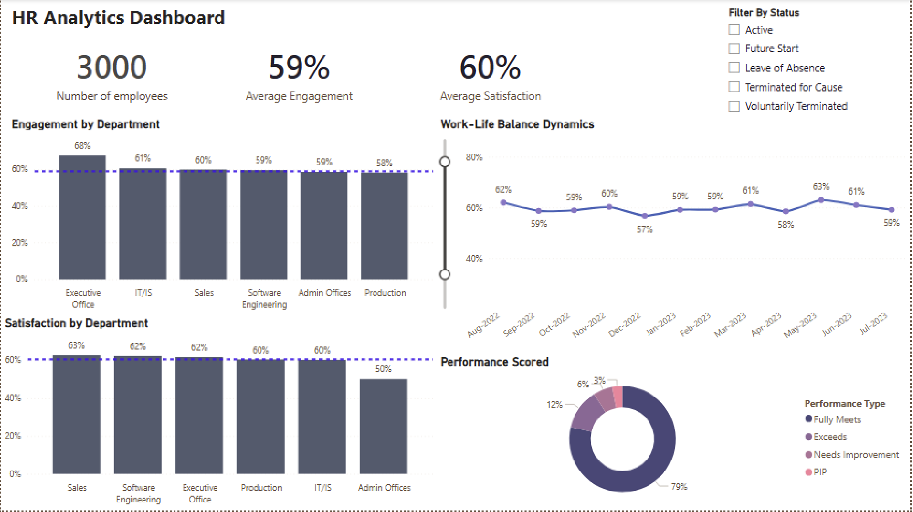

# HR Analytics Dashboard | Power BI

Ever wondered what's really going on with employee engagement across a company? 
This dashboard breaks down the workforce data of **3,000 employees** to surface patterns in engagement, satisfaction, performance, and work-life balance across the organization.

## Dashboard Preview

**KPIs, Engagement and Work-Life Balance**

## What This Project Is About

I built this dashboard using two datasets: employee records and engagement survey responses, covering the period **Aug 2022 to Aug 2023**. The goal was to help HR teams quickly spot which departments are thriving and which ones need attention, without digging through spreadsheets.

## What I Found

- The company has **3,000 employees** with an average engagement of **59%** and average satisfaction of **60%**, both hovering just at or below the benchmark
- **Executive Office leads engagement at 68%**, while Production lags behind at 58%
- **Sales and Software Engineering top satisfaction at 63% and 62%**, while Admin Offices scores the lowest at 50%, which is a clear red flag
- **Work-life balance stayed relatively flat** between 57% and 63% over the year, with a dip in Dec 2022
*Made by Shreya Singh*
